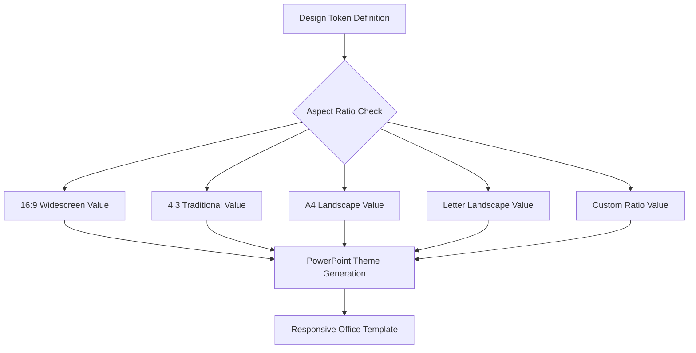

# Aspect Ratio Tokens

Advanced responsive design token system that automatically adapts design elements based on presentation dimensions, enabling truly responsive Office templates.

## Overview

Aspect Ratio Tokens represent StyleStack's breakthrough innovation in responsive design systems for Microsoft Office. Unlike traditional design tokens that have fixed values, aspect ratio tokens dynamically resolve based on the target presentation format, ensuring optimal layouts across all screen sizes.



## Basic Syntax

### Simple Aspect Ratio Token

```json
{
  "typography": {
    "heading": {
      "size": {
        "$aspectRatio": {
          "aspectRatios.widescreen_16_9": "44pt",
          "aspectRatios.traditional_4_3": "40pt",
          "aspectRatios.a4_landscape": "36pt",
          "aspectRatios.letter_landscape": "36pt"
        }
      }
    }
  }
}
```

### Default Value Fallback

```json
{
  "spacing": {
    "margin": {
      "$aspectRatio": {
        "default": "24pt",                        // Fallback for unspecified ratios
        "aspectRatios.widescreen_16_9": "32pt",   // Override for widescreen
        "aspectRatios.traditional_4_3": "20pt"    // Override for traditional
      }
    }
  }
}
```

## Standard Aspect Ratio Keys

### Built-in Aspect Ratios

| Key | Ratio | Dimensions (EMU) | Use Case |
|-----|-------|------------------|----------|
| `aspectRatios.widescreen_16_9` | 16:9 | 10,058,400 × 5,657,600 | Modern presentations, HD displays |
| `aspectRatios.traditional_4_3` | 4:3 | 9,144,000 × 6,858,000 | Legacy projectors, print handouts |
| `aspectRatios.a4_landscape` | √2:1 | 10,826,771 × 7,677,165 | European document standard |
| `aspectRatios.letter_landscape` | 11:8.5 | 10,058,400 × 7,772,400 | US document standard |

### Custom Aspect Ratios

```json
{
  "layouts": {
    "title_position": {
      "$aspectRatio": {
        "21:9": {              // Ultra-wide displays
          "x": "2in",
          "y": "1.5in"
        },
        "1:1": {               // Square format
          "x": "1in", 
          "y": "2in"
        },
        "9:16": {              // Portrait/mobile
          "x": "0.5in",
          "y": "1in"
        }
      }
    }
  }
}
```

## Advanced Patterns

### Conditional Aspect Ratio Logic

```json
{
  "charts": {
    "data_visualization": {
      "layout": {
        "$aspectRatio": {
          "aspectRatios.widescreen_16_9": {
            "orientation": "horizontal",
            "legend_position": "right",
            "chart_width": "8in",
            "chart_height": "4in"
          },
          "aspectRatios.traditional_4_3": {
            "orientation": "vertical", 
            "legend_position": "bottom",
            "chart_width": "6in",
            "chart_height": "4.5in"
          }
        }
      }
    }
  }
}
```

### Nested Aspect Ratio Tokens

```json
{
  "slides": {
    "title_slide": {
      "title": {
        "font_size": {
          "$aspectRatio": {
            "aspectRatios.widescreen_16_9": "48pt",
            "aspectRatios.traditional_4_3": "44pt"
          }
        },
        "position": {
          "x": {
            "$aspectRatio": {
              "aspectRatios.widescreen_16_9": "1.5in",
              "aspectRatios.traditional_4_3": "1.25in"
            }
          },
          "y": {
            "$aspectRatio": {
              "aspectRatios.widescreen_16_9": "2in",
              "aspectRatios.traditional_4_3": "1.75in"
            }
          }
        }
      }
    }
  }
}
```

### Computed Aspect Ratio Values

```json
{
  "spacing": {
    "content_width": {
      "$aspectRatio": {
        "aspectRatios.widescreen_16_9": "$multiply($slideWidth, 0.8)",
        "aspectRatios.traditional_4_3": "$multiply($slideWidth, 0.85)"
      }
    },
    "responsive_margin": {
      "$aspectRatio": {
        "aspectRatios.widescreen_16_9": "$divide($slideHeight, 12)",
        "aspectRatios.traditional_4_3": "$divide($slideHeight, 10)"
      }
    }
  }
}
```

## Typography Responsive Design

### Font Size Scaling

```json
{
  "typography": {
    "display": {
      "font_size": {
        "$aspectRatio": {
          "aspectRatios.widescreen_16_9": "56pt",   // Large displays
          "aspectRatios.traditional_4_3": "48pt",   // Standard displays  
          "aspectRatios.a4_landscape": "42pt",      // Document format
          "21:9": "64pt",                           // Ultra-wide
          "1:1": "40pt"                             // Square format
        }
      }
    },
    "heading": {
      "font_size": {
        "$aspectRatio": {
          "aspectRatios.widescreen_16_9": "44pt",
          "aspectRatios.traditional_4_3": "40pt",
          "aspectRatios.a4_landscape": "36pt",
          "21:9": "50pt",
          "1:1": "32pt"
        }
      }
    },
    "body": {
      "font_size": {
        "$aspectRatio": {
          "aspectRatios.widescreen_16_9": "20pt",
          "aspectRatios.traditional_4_3": "18pt", 
          "aspectRatios.a4_landscape": "16pt",
          "21:9": "22pt",
          "1:1": "16pt"
        }
      }
    }
  }
}
```

### Line Height and Spacing

```json
{
  "typography": {
    "paragraph": {
      "line_height": {
        "$aspectRatio": {
          "aspectRatios.widescreen_16_9": "1.4",    // More space in widescreen
          "aspectRatios.traditional_4_3": "1.3",    // Tighter for better fit
          "aspectRatios.a4_landscape": "1.25"       // Document-optimized
        }
      },
      "paragraph_spacing": {
        "$aspectRatio": {
          "aspectRatios.widescreen_16_9": "24pt",
          "aspectRatios.traditional_4_3": "20pt",
          "aspectRatios.a4_landscape": "18pt"
        }
      }
    }
  }
}
```

## Layout and Positioning

### Grid Systems

```json
{
  "grid": {
    "columns": {
      "$aspectRatio": {
        "aspectRatios.widescreen_16_9": 12,        // More horizontal space
        "aspectRatios.traditional_4_3": 10,        // Fewer columns
        "21:9": 16,                                // Ultra-wide grid
        "1:1": 8                                   // Square grid
      }
    },
    "gutter": {
      "$aspectRatio": {
        "aspectRatios.widescreen_16_9": "24pt",
        "aspectRatios.traditional_4_3": "20pt",
        "21:9": "32pt",
        "1:1": "16pt"
      }
    },
    "margin": {
      "horizontal": {
        "$aspectRatio": {
          "aspectRatios.widescreen_16_9": "72pt",
          "aspectRatios.traditional_4_3": "60pt",
          "aspectRatios.a4_landscape": "56pt"
        }
      },
      "vertical": {
        "$aspectRatio": {
          "aspectRatios.widescreen_16_9": "48pt",
          "aspectRatios.traditional_4_3": "60pt",   // More vertical in 4:3
          "aspectRatios.a4_landscape": "64pt"
        }
      }
    }
  }
}
```

### Element Positioning

```json
{
  "components": {
    "header": {
      "height": {
        "$aspectRatio": {
          "aspectRatios.widescreen_16_9": "1in",
          "aspectRatios.traditional_4_3": "0.8in",
          "aspectRatios.a4_landscape": "0.75in"
        }
      },
      "logo_size": {
        "$aspectRatio": {
          "aspectRatios.widescreen_16_9": "0.6in",
          "aspectRatios.traditional_4_3": "0.5in",
          "aspectRatios.a4_landscape": "0.45in"
        }
      }
    },
    "footer": {
      "height": {
        "$aspectRatio": {
          "aspectRatios.widescreen_16_9": "0.5in",
          "aspectRatios.traditional_4_3": "0.6in",   // Slightly larger for better proportion
          "aspectRatios.a4_landscape": "0.4in"
        }
      }
    }
  }
}
```

## Complex Responsive Patterns

### Breakpoint-Style System

```json
{
  "responsive": {
    "content_density": {
      "$aspectRatio": {
        // Ultra-wide: More content, larger elements
        "21:9": {
          "bullets_per_slide": 8,
          "image_size": "large",
          "spacing": "generous"
        },
        // Widescreen: Balanced content
        "aspectRatios.widescreen_16_9": {
          "bullets_per_slide": 6,
          "image_size": "medium", 
          "spacing": "normal"
        },
        // Traditional: Compact content
        "aspectRatios.traditional_4_3": {
          "bullets_per_slide": 5,
          "image_size": "small",
          "spacing": "tight"
        },
        // Square: Minimal content
        "1:1": {
          "bullets_per_slide": 3,
          "image_size": "small",
          "spacing": "minimal"
        }
      }
    }
  }
}
```

### Multi-Dimensional Responsive Design

```json
{
  "adaptive_layout": {
    "two_column": {
      "availability": {
        "$aspectRatio": {
          "aspectRatios.widescreen_16_9": true,     // Enough width
          "aspectRatios.traditional_4_3": false,    // Too narrow
          "21:9": true,                             // Plenty of width
          "1:1": false                              // Square format
        }
      },
      "column_ratio": {
        "$aspectRatio": {
          "aspectRatios.widescreen_16_9": "60:40",
          "21:9": "70:30"
        }
      }
    }
  }
}
```

## Mathematical Operations

### Proportional Calculations

```json
{
  "proportional_design": {
    "content_width": {
      "$aspectRatio": {
        "aspectRatios.widescreen_16_9": "$multiply($slideWidth, 0.85)",
        "aspectRatios.traditional_4_3": "$multiply($slideWidth, 0.9)",
        "aspectRatios.a4_landscape": "$multiply($slideWidth, 0.88)"
      }
    },
    "title_size": {
      "$aspectRatio": {
        "aspectRatios.widescreen_16_9": "$divide($slideHeight, 8)",
        "aspectRatios.traditional_4_3": "$divide($slideHeight, 7)",
        "1:1": "$divide($slideWidth, 12)"
      }
    }
  }
}
```

### Conditional Calculations

```json
{
  "smart_sizing": {
    "optimal_font_size": {
      "$aspectRatio": {
        "aspectRatios.widescreen_16_9": {
          "$conditional": {
            "if": {"$greater": ["$slideWidth", "9144000"]},  // > 10 inches
            "then": "48pt",
            "else": "44pt"
          }
        },
        "aspectRatios.traditional_4_3": {
          "$conditional": {
            "if": {"$greater": ["$slideHeight", "6858000"]}, // > 7.5 inches  
            "then": "44pt",
            "else": "40pt"
          }
        }
      }
    }
  }
}
```

## Performance Optimization

### Efficient Token Resolution

```json
{
  "performance": {
    // ✅ Good: Pre-calculated values
    "heading_size": {
      "$aspectRatio": {
        "aspectRatios.widescreen_16_9": "44pt",
        "aspectRatios.traditional_4_3": "40pt"
      }
    },
    
    // ❌ Avoid: Complex calculations at runtime
    "complex_calculation": {
      "$aspectRatio": {
        "aspectRatios.widescreen_16_9": "$divide($multiply($slideWidth, 0.8), $add($slideHeight, 100))"
      }
    }
  }
}
```

### Caching Strategy

```json
{
  "cached_values": {
    // Define commonly used calculations once
    "standard_margin": {
      "$aspectRatio": {
        "aspectRatios.widescreen_16_9": "72pt",
        "aspectRatios.traditional_4_3": "60pt"
      }
    },
    
    // Reference cached values
    "content_margin": "$reference(cached_values.standard_margin)",
    "image_margin": "$reference(cached_values.standard_margin)"
  }
}
```

## Best Practices

### 1. Maintain Proportional Relationships

**✅ Good: Consistent scaling**
```json
{
  "typography": {
    "h1": {
      "size": {
        "$aspectRatio": {
          "aspectRatios.widescreen_16_9": "48pt",
          "aspectRatios.traditional_4_3": "44pt"
        }
      }
    },
    "h2": {
      "size": {
        "$aspectRatio": {
          "aspectRatios.widescreen_16_9": "36pt",    // 48pt × 0.75
          "aspectRatios.traditional_4_3": "33pt"     // 44pt × 0.75
        }
      }
    }
  }
}
```

### 2. Provide Sensible Defaults

**✅ Good: Default fallback**
```json
{
  "spacing": {
    "margin": {
      "$aspectRatio": {
        "default": "24pt",                          // Fallback
        "aspectRatios.widescreen_16_9": "32pt",     // Specific override
        "aspectRatios.traditional_4_3": "20pt"      // Specific override
      }
    }
  }
}
```

### 3. Test Across All Target Ratios

**✅ Validation approach:**
```bash
# Generate test SuperTheme with all target ratios
python build.py --supertheme --designs test_tokens.json --ratios 16:9,4:3,a4,21:9 --out test.thmx

# Test in PowerPoint
# 1. Apply theme
# 2. Switch between slide sizes
# 3. Verify proportional scaling
# 4. Check readability at all sizes
```

## Integration with SuperThemes

Aspect ratio tokens are automatically processed during SuperTheme generation:

```bash
# Aspect ratio tokens are resolved for each target ratio
python build.py --supertheme --designs responsive_design.json --ratios 16:9,4:3 --out responsive.thmx
```

**Generated variants:**
- Variant 1: Design with 16:9 aspect ratio token values
- Variant 2: Design with 4:3 aspect ratio token values

This aspect ratio token system enables truly responsive Office templates that maintain professional quality across all presentation formats, revolutionizing how design systems adapt to different screen dimensions.