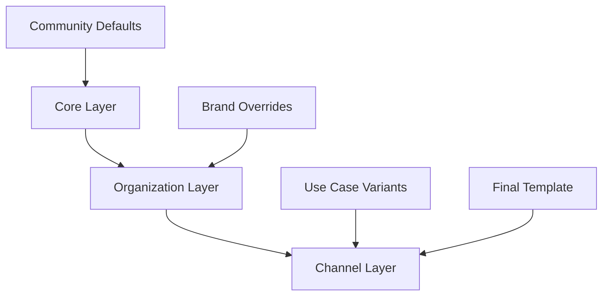

# Token Hierarchy

StyleStack uses a three-layer hierarchical system for design tokens that enables community-driven defaults while allowing organizational customization. This hierarchy ensures consistency while providing flexibility for institutional branding and compliance requirements.

## Three-Layer Architecture



### Layer 1: Core (Community Baseline)

**Purpose:** Community-maintained defaults that replace Microsoft's outdated 1995 styling  
**Maintained by:** StyleStack community  
**Update frequency:** Major releases (quarterly)  
**Override policy:** Should not be modified by organizations  

```json
# core/tokens/base.json
colors:
  # Modern, accessible color palette
  primary: "#2563EB"        # Blue 600 - professional, trustworthy
  secondary: "#64748B"      # Slate 500 - neutral, readable
  accent: "#059669"         # Emerald 600 - success, call-to-action
  
  # Semantic colors
  text_primary: "#0F172A"   # Slate 900 - high contrast
  text_secondary: "#475569" # Slate 600 - medium contrast  
  text_muted: "#94A3B8"     # Slate 400 - low contrast
  
  # Background colors
  surface: "#FFFFFF"        # Pure white
  surface_secondary: "#F8FAFC" # Slate 50 - subtle background
  
fonts:
  # Modern, readable typefaces
  heading: "Inter"          # Clean, modern sans-serif
  body: "Inter"             # Same family for consistency
  monospace: "JetBrains Mono" # Code and data display
  
typography:
  # Accessible sizing and spacing
  scale_ratio: 1.25         # Major third scale
  base_size: "14pt"         # Readable base size
  line_height: 1.6          # Comfortable reading
  heading_line_height: 1.2  # Tight headings
  
spacing:
  # 8pt grid system
  unit: "8pt"               # Base unit
  scale: [4, 8, 12, 16, 24, 32, 48, 64] # Consistent scale
  
accessibility:
  # WCAG 2.1 compliance
  min_contrast_ratio: 4.5   # AA standard
  min_font_size: "12pt"     # Minimum readable size
  focus_outline: "2pt solid {accent}" # Clear focus indicators
```

### Layer 2: Organization (Brand Overrides)

**Purpose:** Institutional branding and compliance requirements  
**Maintained by:** Each organization  
**Update frequency:** As needed for brand changes  
**Override policy:** Can override core tokens, inherits unspecified values  

```json
# org/university-of-example/patches.json
organization:
  name: "University of Example"
  domain: "example.edu"
  
colors:
  # Override core colors with university brand
  primary: "#002856"        # University navy blue
  secondary: "#FFD700"      # University gold
  accent: "#C41E3A"         # University red
  
  # Keep core text colors (inherit)
  # text_primary: inherited from core
  # text_secondary: inherited from core
  
fonts:
  # University brand typography
  heading: "Trajan Pro"     # Classical serif for headers
  body: "Minion Pro"        # Readable serif for body
  # monospace: inherited from core
  
assets:
  # University brand assets
  logo: "assets/university-logo.png"
  seal: "assets/official-seal.png"
  watermark: "assets/confidential-watermark.png"
  
compliance:
  # Educational compliance requirements
  ferpa: true               # FERPA privacy compliance
  ada: true                 # ADA accessibility compliance
  accessibility_statement: "assets/accessibility-statement.pdf"
  
localization:
  # Multi-language support
  primary_language: "en-US"
  supported_languages: ["en-US", "es-ES"]
```

### Layer 3: Channel (Use Case Variants)

**Purpose:** Specific use case optimizations  
**Maintained by:** Organizations or community  
**Update frequency:** Feature releases  
**Override policy:** Can override organization and core tokens  

```json
# org/university-of-example/channels/academic-presentation.json
name: "Academic Presentations"
description: "For lectures, conference presentations, and research talks"
target_products: ["potx"]

typography:
  # Larger fonts for projection
  base_size: "20pt"         # Override org/core base size
  title_size: "48pt"        # Large titles for visibility
  
colors:
  # High contrast for projection
  slide_background: "{primary}"    # Navy background
  text_primary: "#FFFFFF"          # White text
  accent: "{secondary}"            # Gold for highlights
  
layouts:
  # Academic-specific layouts
  title_slide_style: "academic"
  section_divider: true
  bibliography_slide: true
  
accessibility:
  # Enhanced for large rooms
  min_font_size: "18pt"     # Larger minimum for distance viewing
  high_contrast_mode: true  # Enhanced contrast
```

## Token Resolution Process

### Resolution Order (Highest to Lowest Priority)

1. **Channel-specific tokens**
2. **Organization tokens** 
3. **Core baseline tokens**

### Resolution Example

Given these token definitions:

```json
# core/tokens/base.json
colors:
  primary: "#2563EB"
  text: "#0F172A"
  accent: "#059669"

# org/acme/patches.json  
colors:
  primary: "#1E40AF"      # Override core primary
  # text: inherited from core
  # accent: inherited from core

# org/acme/channels/presentation.json
colors:
  accent: "#F59E0B"       # Override org/core accent
  # primary: inherited from org
  # text: inherited from core
```

**Final resolved tokens:**
```json
colors:
  primary: "#1E40AF"      # From organization layer
  text: "#0F172A"         # From core layer (inherited)  
  accent: "#F59E0B"       # From channel layer
```

## Inheritance Patterns

### Full Inheritance
Token not specified in higher layers inherits from lower layers:

```json
# Core defines comprehensive baseline
fonts:
  heading: "Inter"
  body: "Inter"
  monospace: "JetBrains Mono"

# Organization overrides only heading
fonts:
  heading: "Montserrat"
  # body and monospace inherited from core

# Final result
fonts:
  heading: "Montserrat"     # From organization
  body: "Inter"             # From core
  monospace: "JetBrains Mono" # From core
```

### Partial Inheritance with Extension
Higher layers can extend lower layer configurations:

```json
# Core defines base spacing
spacing:
  unit: "8pt"
  sm: "8pt"
  md: "16pt"
  lg: "24pt"

# Organization adds custom spacing
spacing:
  unit: "8pt"          # Keep core unit
  xl: "48pt"           # Add extra large
  xxl: "64pt"          # Add extra extra large
  
# Channel modifies for specific use
spacing:
  unit: "12pt"         # Larger base unit for presentations
  # All other values scale proportionally
```

### Reference Resolution
Tokens can reference other tokens across layers:

```json
# Core baseline
colors:
  primary: "#2563EB"

# Organization uses core primary as reference
colors:
  primary: "#1E40AF"                    # Override primary
  primary_light: "{primary.lighten(20%)}" # Reference overridden primary
  link_color: "{primary}"               # Reference overridden primary

# Channel further customizes
colors:
  button_color: "{primary_light}"       # Reference organization token
```

## Layer Management Strategies

### Core Layer (Community)

**Best Practices:**
- Focus on accessibility and modern defaults
- Provide comprehensive baseline covering all use cases
- Use semantic naming for broad applicability
- Maintain backward compatibility across versions
- Test across different Office versions and platforms

**Update Strategy:**
```json
# Version-controlled core updates
core:
  version: "1.4.0"
  compatibility: 
    min_version: "1.0.0"
    breaking_changes: []
    
  changelog:
    "1.4.0":
      - "Improved color contrast ratios"
      - "Updated font stack for better web font support"
      - "Added new spacing tokens for consistency"
```

### Organization Layer

**Best Practices:**
- Override only what's necessary for brand compliance
- Document rationale for each override
- Maintain accessibility standards
- Test customizations thoroughly
- Plan for core layer updates

**Governance Framework:**
```json
# Organization governance rules
governance:
  token_approval_required:
    - "colors.primary"      # Brand manager approval
    - "fonts.*"            # Design team approval
    - "accessibility.*"    # Compliance team approval
    
  auto_approved:
    - "spacing.*"          # Layout adjustments
    - "assets.*"           # Asset updates
    
  restricted:
    - "core.*"             # Cannot modify core tokens directly
```

### Channel Layer

**Best Practices:**
- Focus on use-case specific optimizations
- Keep changes minimal and purposeful
- Ensure compatibility across products (PowerPoint, Word, Excel)
- Test in target environments

**Channel Categories:**
```json
# Standard channel types
channels:
  presentation:
    optimized_for: "projection"
    font_scaling: 1.2
    contrast_enhanced: true
    
  document:
    optimized_for: "reading"
    line_spacing: 1.6
    margin_generous: true
    
  finance:
    optimized_for: "data_density"
    monospace_emphasis: true
    table_formatting: "enhanced"
```

## Conflict Resolution

### Override Rules

1. **Explicit wins over implicit**
2. **Higher layer wins over lower layer**
3. **Later definition wins over earlier** (within same layer)
4. **Required tokens must be satisfied** at some layer

### Error Handling

```json
# Token validation and fallbacks
validation:
  required_tokens:
    - "colors.primary"
    - "fonts.body"
    - "spacing.unit"
    
  fallback_strategy:
    missing_color: "#000000"      # Safe black fallback
    missing_font: "Arial"         # Universal fallback font
    missing_spacing: "8pt"        # Standard spacing unit
    
  warnings:
    - "accessibility_violation"   # WCAG contrast failure
    - "missing_asset"            # Referenced asset not found
    - "deprecated_token"         # Using deprecated token name
```

## Migration Strategies

### Core Version Updates

```bash
# Sync with upstream core updates
git fetch upstream
git checkout -b update-core-v1.4.0

# Review core changes
git diff upstream/v1.3.0..upstream/v1.4.0 core/

# Test with organization overrides
python build.py --org acme --test-compatibility

# Resolve any conflicts
git merge upstream/v1.4.0
```

### Token Deprecation

```json
# Gradual token deprecation
deprecated_tokens:
  old_primary_color:
    replacement: "colors.primary"
    deprecation_version: "1.3.0"
    removal_version: "2.0.0"
    migration_guide: "docs/migration/v2.0.0.md"
```

## Next Steps

- [Learn token customization techniques](./customization.md)
- [Explore all available variables](./variables.md)  
- [See hierarchy in action](../examples/university.md)
- [Set up organization governance](../fork-management/governance.md)