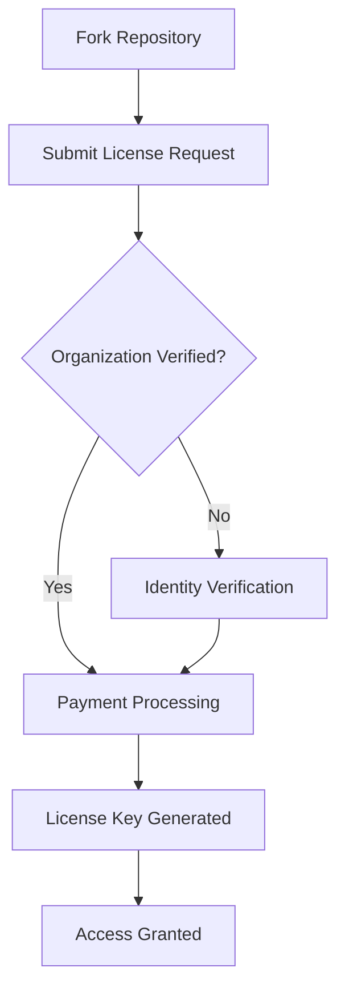
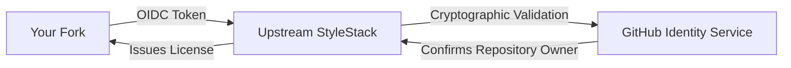

# Request a License

This guide walks through requesting a StyleStack license for commercial use.

## Prerequisites

1. **Fork StyleStack** to your organization's GitHub account
2. **Verify your identity** - GitHub account must be associated with your organization
3. **Payment method** ready (for Professional/Enterprise tiers)

## Step-by-Step Process

### 1. Navigate to GitHub Actions

In your forked repository, go to:
- **Actions** tab → **Request StyleStack License** workflow
- Click **"Run workflow"**



### 2. Select License Tier

Choose your desired tier:

| Tier | Best For | Price |
|------|----------|-------|
| **Professional** | Growing companies, agencies | $25/user/month |
| **Enterprise** | Large organizations, white-label | $50/user/month |

### 3. Provide Purpose (Optional)

Help us understand your use case:
- "Corporate presentation templates"  
- "Client deliverables for design agency"
- "Internal training materials"
- "Product documentation system"

### 4. Submit Request

Click **"Run workflow"** to submit your license request.

## What Happens Next

### Automatic Identity Verification

StyleStack uses **GitHub OIDC tokens** to verify your identity:



This prevents:
- ❌ Fake identity claims
- ❌ License sharing between organizations  
- ❌ Unauthorized usage

### Payment Processing

For **Professional** and **Enterprise** tiers:

1. **Invoice Created** - Tracked in GitHub issue
2. **Payment Link Sent** - Via email or GitHub notification
3. **Payment Verification** - Automatic webhook integration
4. **License Issued** - Delivered immediately after payment

### License Delivery

Once approved and paid:

1. **Encrypted License File** created in `.github/licenses/`
2. **Repository Secret** optionally created for CI/CD
3. **Automatic Validation** - Build system detects new license
4. **Confirmation Summary** - Full activation details

## Using Your License

### Automatic Detection

No configuration needed! The license is automatically detected:

```bash
# Just works after license is delivered
python build.py --org "my-company" --channel present --out presentation.potx
```

### Manual License String (Optional)

For CI/CD environments, set as repository secret:

```yaml
# .github/workflows/build-templates.yml
- name: Build templates
  run: python build.py --org "${{ secrets.ORG_NAME }}" --out template.potx
  env:
    STYLESTACK_LICENSE: ${{ secrets.STYLESTACK_LICENSE }}
```

### Validation

Verify your license is working:

```bash
python tools/github_license_manager.py validate --org "my-company"
```

Expected output:
```
✅ Valid professional license for my-company
   Source: encrypted_file
   Features: custom_tokens, multi_platform, unlimited_forks
   Expires: 2025-12-31T23:59:59Z
```

## Troubleshooting

### Common Issues

#### "License required for [org-name]"

**Cause**: No valid license found for your organization name

**Solutions**:
1. Check that license request workflow completed successfully
2. Verify organization name matches exactly (case sensitive)  
3. Look for encrypted license file in `.github/licenses/[org].license.enc`
4. Re-run license request workflow if needed

#### "OIDC token not available"

**Cause**: Missing `id-token: write` permission in workflow

**Solution**: Ensure your workflow has proper permissions:
```yaml
permissions:
  id-token: write  # Required for OIDC
  contents: write  # Required to save license
```

#### "Payment required"

**Cause**: Commercial organization needs paid license

**Solutions**:
1. Complete payment process via provided link
2. For open source: Add `nonprofit`, `education`, or similar to org name
3. Ensure repository has valid OSS license file

### Getting Help

- **Community Support**: [GitHub Discussions](https://github.com/BramAlkema/StyleStack/discussions)
- **Professional/Enterprise**: Email support@stylestack.dev  
- **Urgent Issues**: Create issue with `urgent` label

## License Management

### Renewal

Licenses are automatically renewed based on your subscription:
- **Professional**: Monthly billing cycle
- **Enterprise**: Annual contracts available

### Upgrading Tiers

To upgrade from Professional to Enterprise:
1. Request new license with Enterprise tier
2. Cancel previous Professional subscription  
3. New license automatically replaces old one

### Multi-Repository

Each repository fork needs its own license:
- **Professional**: $25/user across all repositories
- **Enterprise**: Volume discounts available for 10+ repositories

### Transfer Ownership

When transferring repository ownership:
1. New owner must request fresh license
2. Original license becomes invalid
3. Pro-rated refunds available within 30 days

## Next Steps

- **[Pricing Details →](./pricing.md)** - Compare features and costs
- **[Technical Implementation →](./technical-implementation.md)** - How licensing works  
- **[Fork Management →](../fork-management/overview.md)** - Managing your StyleStack fork
- **[Getting Started →](../getting-started/quick-start.md)** - Build your first template