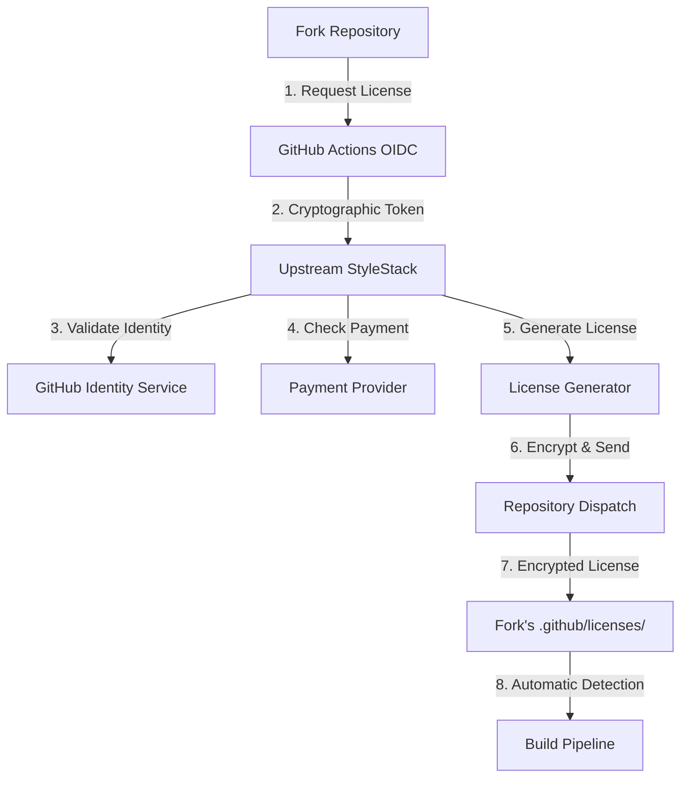

# Technical Implementation

This document explains how StyleStack's GitHub-native licensing system works under the hood.

## Architecture Overview



## Components

### 1. OIDC Token Authentication

GitHub provides cryptographically signed identity tokens that cannot be forged:

```yaml
# In license request workflow
- name: Get OIDC token
  id: oidc
  uses: actions/github-script@v7
  with:
    script: |
      const token = await core.getIDToken('https://github.com/BramAlkema/StyleStack')
      return token
```

**Token Claims Include:**
- `repository`: Full repository path (e.g., `acme-corp/StyleStack`)
- `actor`: User who triggered the workflow
- `ref`: Git reference (branch/tag)
- `sha`: Commit SHA
- `aud`: Audience (StyleStack's GitHub URL)
- `iss`: Issuer (GitHub's OIDC endpoint)

### 2. License Generation

Licenses are JSON objects with cryptographic signatures:

```json
{
  "org": "acme-corp",
  "tier": "professional", 
  "issued": "2025-01-15T10:30:00Z",
  "expires": "2026-01-15T10:30:00Z",
  "features": ["custom_tokens", "multi_platform", "unlimited_forks"],
  "signature": "sha256:abc123...",
  "version": "1.0"
}
```

**Signature Verification:**
```python
# Prevents tampering
message = f"{org}:{tier}:{expires}"
expected_sig = hmac.new(secret.encode(), message.encode(), sha256).hexdigest()
assert hmac.compare_digest(license_data['signature'], expected_sig)
```

### 3. Encrypted Storage

Licenses are encrypted using AES-256-CBC with repository-specific keys:

```python
def encrypt_license(license_str: str, repo_info: dict) -> bytes:
    # Derive encryption key from repository metadata
    key_material = f"{repo_info['owner']}:{repo_info['name']}:stylestack"
    key = hashlib.sha256(key_material.encode()).digest()[:32]
    
    # Generate random IV
    iv = os.urandom(16)
    
    # Encrypt with AES-256-CBC
    cipher = AES.new(key, AES.MODE_CBC, iv)
    encrypted = cipher.encrypt(pad_data(license_str))
    
    return iv + encrypted  # IV + ciphertext
```

**File Structure:**
```
.github/licenses/
├── acme-corp.license.enc    # Encrypted license for acme-corp
├── public_key.pem           # Public key for verification (optional)
└── .gitignore               # Ensure secrets aren't committed
```

### 4. Multi-Source Validation

The license manager checks multiple sources in order of priority:

```python
def validate_license(org_name: str) -> Tuple[bool, Dict]:
    # 1. Environment variable (highest priority - for CI/CD)
    if env_license := os.getenv('STYLESTACK_LICENSE'):
        return validate_license_string(env_license, org_name)
    
    # 2. Encrypted file (for offline use)
    license_file = Path(f".github/licenses/{org_name}.license.enc")
    if license_file.exists():
        return validate_encrypted_file(license_file, org_name)
    
    # 3. GitHub secret (in Actions context)  
    if os.getenv('GITHUB_ACTIONS'):
        secret_name = f'LICENSE_{org_name.upper().replace("-", "_")}'
        if secret_license := os.getenv(secret_name):
            return validate_license_string(secret_license, org_name)
    
    # 4. Check community tier eligibility
    if is_open_source(org_name):
        return True, {'tier': 'community', 'source': 'auto_detected'}
    
    return False, {'error': 'No valid license found'}
```

## Security Features

### Cryptographic Identity Verification

**OIDC Token Structure:**
```
Header:  {"alg": "RS256", "typ": "JWT", "kid": "github-key-id"}
Payload: {
  "iss": "https://token.actions.githubusercontent.com",
  "aud": "https://github.com/BramAlkema/StyleStack", 
  "sub": "repo:acme-corp/StyleStack:ref:refs/heads/main",
  "repository": "acme-corp/StyleStack",
  "actor": "john.doe",
  "exp": 1642678200
}
Signature: [GitHub's RSA signature]
```

**Why This Is Secure:**
- **GitHub signs tokens** with their private key (impossible to forge)
- **Audience verification** ensures tokens are for StyleStack
- **Repository binding** prevents cross-repository token reuse  
- **Time-limited** tokens expire automatically
- **Actor tracking** provides audit trail

### License Sharing Prevention

Each license is cryptographically bound to a specific repository:

```python
# License signature includes repository-specific data
def generate_signature(org: str, tier: str, expires: str, repo_id: str) -> str:
    # Repository ID prevents sharing between forks
    message = f"{org}:{tier}:{expires}:{repo_id}"
    secret = f"stylestack-{repo_id}-{org}"  # Unique per repo
    return hmac.new(secret.encode(), message.encode(), sha256).hexdigest()
```

**Anti-Sharing Measures:**
- ✅ Repository-specific encryption keys
- ✅ Unique signatures per fork  
- ✅ OIDC tokens tied to specific repos
- ✅ Automatic license invalidation on repository transfer

### Offline Security

Encrypted licenses work offline but include multiple security layers:

```python
def decrypt_offline_license(encrypted_file: Path, repo_context: dict) -> dict:
    # 1. Verify file hasn't been tampered with
    file_hash = hashlib.sha256(encrypted_file.read_bytes()).hexdigest()
    
    # 2. Derive decryption key from repository context
    key = derive_repo_key(repo_context)
    
    # 3. Decrypt and verify internal signature
    license_data = decrypt_aes_cbc(encrypted_file.read_bytes(), key)
    
    # 4. Verify license signature matches repository
    if not verify_license_signature(license_data, repo_context):
        raise SecurityError("License signature mismatch")
    
    return license_data
```

## Integration Points

### Build System Integration

The build system automatically detects licenses without configuration:

```python
# In build.py
def enforce_licensing(org_name: str):
    license_manager = GitHubLicenseManager()
    
    # Skip for upstream repo and CI testing
    if is_upstream_repo() or is_ci_testing():
        return
    
    # Automatic license detection and validation
    is_valid, license_info = license_manager.validate_license(org_name)
    
    if not is_valid:
        display_license_help(org_name, license_info)
        sys.exit(1)
    
    print(f"✅ {license_info['tier']} license validated")
```

### CI/CD Integration

Multiple ways to provide licenses in automated environments:

```yaml
# Option 1: Repository secret (recommended)
- name: Build template
  run: python build.py --org "${{ secrets.ORG_NAME }}"
  env:
    STYLESTACK_LICENSE: ${{ secrets.STYLESTACK_LICENSE }}

# Option 2: Encrypted file (automatic)  
- name: Build template
  run: python build.py --org "my-company"
  # License automatically detected from .github/licenses/

# Option 3: Dynamic license request (advanced)
- name: Request license
  uses: ./.github/workflows/license-request
  with:
    tier: professional
```

### API Integration (Future)

Licenses can be validated via API for advanced integrations:

```python
# Future: Token API integration
def validate_api_access(license_info: dict) -> bool:
    if 'api_access' not in license_info.get('features', []):
        return False
    
    # Check API rate limits based on tier
    tier = license_info['tier']
    api_limits = {
        'professional': 10000,  # calls/month
        'enterprise': -1        # unlimited
    }
    
    return check_rate_limit(license_info['org'], api_limits[tier])
```

## Development Workflow

### Testing Licenses

```bash
# Validate existing license
python tools/github_license_manager.py validate --org "my-company"

# Generate test license (upstream only)  
python tools/github_license_manager.py generate --org "test-org" --tier "professional"

# Save license for testing
python tools/github_license_manager.py save --org "test-org" --license "[license-string]"
```

### Local Development

```python
# Skip licensing during development
export STYLESTACK_SKIP_LICENSE=true
python build.py --org "any-org" --out test.potx

# Or use community tier
python build.py --org "my-nonprofit" --out test.potx  # Auto-detected
```

### Contributing

When contributing to StyleStack licensing system:

1. **Test with multiple tiers** - Ensure all license tiers work
2. **Verify security** - No license bypasses or vulnerabilities  
3. **Check offline mode** - Encrypted files work without internet
4. **Validate OIDC** - Identity verification cannot be spoofed
5. **Update docs** - Keep this technical documentation current

## Monitoring & Analytics

### License Usage Tracking

```python
# Track license usage for analytics
def track_license_usage(license_info: dict, operation: str):
    analytics_data = {
        'org': license_info['org'],
        'tier': license_info['tier'], 
        'operation': operation,  # 'build', 'validate', etc.
        'timestamp': datetime.utcnow().isoformat(),
        'source': license_info.get('source', 'unknown')
    }
    
    # Send to analytics service (respects privacy settings)
    if license_info.get('analytics_enabled', True):
        send_anonymous_analytics(analytics_data)
```

### Health Monitoring  

Upstream monitors licensing system health:

- **License request volume** - Detect usage patterns
- **Payment conversion rates** - Optimize pricing
- **Error rates** - Identify technical issues  
- **Geographic distribution** - Plan regional support

## Compliance & Auditing

### Audit Trail

Every license operation creates an audit record:

```json
{
  "timestamp": "2025-01-15T10:30:00Z",
  "event": "license_requested",
  "repository": "acme-corp/StyleStack",
  "actor": "john.doe@acme-corp.com",
  "tier": "professional", 
  "oidc_claims": {...},
  "ip_address": "203.0.113.42",
  "user_agent": "GitHub Actions"
}
```

### GDPR Compliance

- **Data minimization** - Only store necessary license data
- **Right to deletion** - License deletion on request  
- **Consent tracking** - Record user consent for data processing
- **Data portability** - Export license data on request

### SOC 2 Controls

**Security Controls:**
- Cryptographic key management
- Access control and authorization  
- Vulnerability management
- Incident response procedures

**Availability Controls:**  
- GitHub's 99.95% uptime SLA
- Offline license functionality
- Redundant license storage

**Processing Integrity:**
- OIDC token verification
- License signature validation
- Automated compliance testing

**Confidentiality Controls:**
- End-to-end encryption
- Repository-specific keys  
- No plaintext license storage

**Privacy Controls:**
- Minimal data collection
- Automated data retention
- User consent management