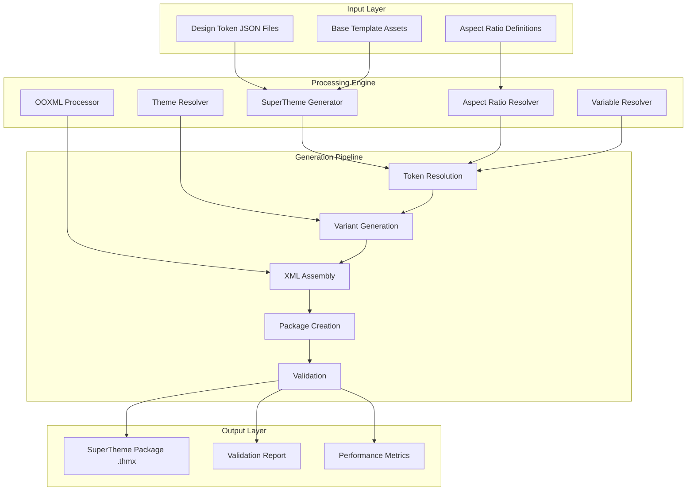

# SuperThemes Architecture

This guide provides a comprehensive understanding of StyleStack's SuperTheme architecture, design patterns, and technical implementation details.

## System Overview

StyleStack SuperThemes are built on a multi-layered architecture that transforms design tokens into Microsoft Office-compatible theme packages through a sophisticated processing pipeline.



## Core Components

### 1. SuperTheme Generator

**Location**: `tools/supertheme_generator.py`

The central orchestrator that coordinates the entire SuperTheme generation process.

**Key Responsibilities:**
- Design variant loading and validation
- Aspect ratio coordination
- Theme generation orchestration
- Package assembly and output

**Architecture Pattern**: *Factory + Strategy*
```python
class SuperThemeGenerator:
    def __init__(self, verbose=False, enable_cache=True):
        self.aspect_resolver = AspectRatioResolver()
        self.theme_resolver = ThemeResolver()
        self.variable_resolver = VariableResolver()
        
    def generate_supertheme(self, design_variants, aspect_ratios=None):
        # 1. Resolve aspect ratios
        # 2. Generate all theme variants  
        # 3. Create OOXML package
        # 4. Validate result
```

### 2. Aspect Ratio Resolver

**Location**: `tools/aspect_ratio_resolver.py`

Handles the complex mathematics of multi-aspect-ratio design systems with EMU-precise calculations.

**Key Features:**
- **EMU (English Metric Units)** precision for Office compatibility
- **Standard aspect ratio library** (16:9, 4:3, A4, Letter)
- **Custom aspect ratio support** for specialized use cases
- **Responsive token resolution** based on screen dimensions

**Mathematical Foundation:**
```python
# EMU Calculations (Office native units)
# 1 inch = 914,400 EMUs
# 1 point = 12,700 EMUs

class AspectRatioToken:
    width_emu: int      # Width in English Metric Units
    height_emu: int     # Height in English Metric Units
    ratio: float        # Mathematical aspect ratio
    orientation: str    # 'landscape' or 'portrait'
```

### 3. Design Token System

**Hierarchical Resolution Pattern:**
```
Global Design System 2025
    ↓ (inherits)
Corporate Brand Layer  
    ↓ (overrides)
Channel Specialization
    ↓ (contextualizes)
Template Implementation
    ↓ (renders)
Final OOXML Output
```

**Token Resolution Algorithm:**
```python
def resolve_token(token_path, context):
    # 1. Check template-level overrides
    # 2. Check channel-level defaults
    # 3. Check corporate brand values
    # 4. Fall back to global design system
    # 5. Apply aspect ratio transformations
    # 6. Convert to Office-compatible units
```

### 4. OOXML Processing Pipeline

**Location**: `tools/ooxml_processor.py`

Transforms resolved design tokens into valid Office Open XML structures.

**Processing Stages:**
1. **XML Parsing**: lxml-based robust parsing with recovery
2. **XPath Targeting**: Precise element selection and modification
3. **Namespace Management**: Office 2016-365 compatibility
4. **Content Transformation**: Token-to-OOXML conversion
5. **Validation**: Schema compliance and integrity checks

**Performance Optimizations:**
- **Dual Engine Support**: lxml (primary) + ElementTree (fallback)
- **XPath Caching**: Compiled XPath expressions for repeated use
- **Batch Processing**: Multiple operations in single XML tree traversal
- **Memory Management**: Streaming for large document processing

## Package Structure

### SuperTheme (.thmx) Package Layout

```
corporate_supertheme.thmx
├── [Content_Types].xml              # MIME type definitions
├── _rels/
│   └── .rels                        # Main relationships
├── themeVariants/
│   ├── themeVariantManager.xml      # Variant registry
│   ├── _rels/
│   │   └── themeVariantManager.xml.rels
│   ├── variant1/                    # Design 1, Aspect Ratio 1
│   │   ├── theme/
│   │   │   ├── theme/
│   │   │   │   └── theme1.xml       # Theme definition
│   │   │   └── presentation.xml     # Slide dimensions
│   │   └── _rels/
│   │       └── .rels
│   ├── variant2/                    # Design 1, Aspect Ratio 2
│   ├── variant3/                    # Design 2, Aspect Ratio 1
│   └── variant4/                    # Design 2, Aspect Ratio 2
└── theme/                           # Base theme assets
    └── theme/
        └── slideMasters/
            └── slideMaster1.xml
```

### Variant Numbering System

**Algorithm**: `variant_id = (design_index * aspect_ratio_count) + aspect_ratio_index + 1`

**Example with 2 designs × 3 aspect ratios:**
- variant1: Corporate Blue + 16:9
- variant2: Corporate Blue + 4:3  
- variant3: Corporate Blue + A4
- variant4: Modern Green + 16:9
- variant5: Modern Green + 4:3
- variant6: Modern Green + A4

## Advanced Design Patterns

### 1. Token Inheritance and Overrides

**Hierarchical Token Resolution:**
```json
{
  "colors": {
    "brand": {
      "primary": "#0066CC",           // Global default
      "$channel": {
        "presentation": "#0052A3",    // Channel override
        "document": "#004080"         // Different channel value
      }
    }
  }
}
```

**Aspect Ratio Responsive Tokens:**
```json
{
  "typography": {
    "heading": {
      "size": {
        "$aspectRatio": {
          "aspectRatios.widescreen_16_9": "44pt",
          "aspectRatios.traditional_4_3": "40pt",
          "aspectRatios.a4_landscape": "36pt"
        }
      }
    }
  }
}
```

### 2. Conditional Logic System

**Complex Token Resolution:**
```json
{
  "layouts": {
    "title_slide": {
      "logo_size": {
        "$conditional": {
          "if": {"$aspectRatio": "aspectRatios.widescreen_16_9"},
          "then": "2.5in",
          "else": {
            "$aspectRatio": {
              "aspectRatios.traditional_4_3": "2.2in",
              "aspectRatios.a4_landscape": "2.0in"
            }
          }
        }
      }
    }
  }
}
```

### 3. Performance Optimization Strategies

**Caching Architecture:**
```python
class SuperThemeGenerator:
    def __init__(self, enable_cache=True):
        self._guid_cache = {}           # GUID reuse for variants
        self._theme_cache = {}          # Theme object caching
        self._presentation_cache = {}   # Presentation XML caching
        self._aspect_ratio_cache = {}   # Dimension calculations
```

**Lazy Loading Pattern:**
```python
@lru_cache(maxsize=128)
def resolve_aspect_ratio_token(self, aspect_ratio_key):
    # Expensive calculation cached automatically
    return self._calculate_dimensions(aspect_ratio_key)
```

## Validation System

### Multi-Layer Validation Pipeline

**Location**: `tools/supertheme_validator.py`

```python
class SuperThemeValidator:
    def validate_package(self, package_data):
        # 1. ZIP integrity validation
        # 2. Package structure validation  
        # 3. Content type validation
        # 4. XML schema validation
        # 5. Office namespace validation
        # 6. Cross-platform compatibility
        # 7. Performance optimization checks
```

**Validation Categories:**
- **Structure**: Required files, directory layout, variant consistency
- **Content Types**: MIME type correctness for Office compatibility
- **XML**: Well-formedness, namespace compliance, schema validation
- **Performance**: File sizes, optimization recommendations
- **Compatibility**: Cross-platform paths, character encoding

### Error Recovery Strategies

**lxml Recovery Parser:**
```python
parser = etree.XMLParser(recover=True, remove_comments=False)
# Automatically repairs minor XML issues
# Provides detailed error reporting for major issues
```

**Graceful Degradation:**
```python
if LXML_AVAILABLE:
    # Use lxml for robust parsing with recovery
    parser = etree.XMLParser(recover=True)
else:
    # Fall back to ElementTree for basic functionality  
    import xml.etree.ElementTree as etree
```

## Extension Points

### 1. Custom Aspect Ratio Providers

```python
class CustomAspectRatioProvider:
    def get_aspect_ratios(self):
        return {
            "custom.ultrawide_32_9": AspectRatioToken(
                width_emu=32 * 914400,  # 32 inches
                height_emu=9 * 914400,  # 9 inches  
                ratio=32/9,
                orientation='landscape'
            )
        }
```

### 2. Theme Generation Hooks

```python
class SuperThemeGenerator:
    def __init__(self, theme_hooks=None):
        self.theme_hooks = theme_hooks or []
        
    def _generate_theme_xml(self, theme):
        xml = self._base_theme_generation(theme)
        
        # Apply custom theme hooks
        for hook in self.theme_hooks:
            xml = hook.transform_theme_xml(xml, theme)
            
        return xml
```

### 3. Custom Validation Rules

```python
class CustomValidator:
    def validate_corporate_compliance(self, result, package_data):
        # Add custom corporate brand validation
        # Check logo usage, color compliance, etc.
        pass
```

## Performance Characteristics

### Generation Performance

**Typical Performance Metrics:**
- **Small SuperTheme** (1 design × 2 ratios): ~0.1s generation time
- **Medium SuperTheme** (3 designs × 4 ratios): ~0.3s generation time  
- **Large SuperTheme** (10 designs × 6 ratios): ~1.2s generation time

**Memory Usage:**
- **Base Memory**: ~50MB for StyleStack core
- **Per Variant**: ~2-5MB depending on complexity
- **Peak Memory**: Typically 2-3x final package size

### File Size Optimization

**Package Size Guidelines:**
- **Recommended**: < 5MB for optimal PowerPoint performance
- **Maximum**: < 10MB for compatibility
- **Typical**: 0.02-2MB for standard corporate themes

**Optimization Techniques:**
- **Asset Deduplication**: Shared theme elements across variants
- **XML Minification**: Optimized whitespace and structure
- **Compression**: ZIP-level optimization for package size

## Security Considerations

### Input Validation

**Design Token Sanitization:**
```python
def validate_design_tokens(tokens):
    # Prevent XML injection attacks
    # Validate file path traversals  
    # Check for malicious content
    # Limit resource consumption
```

**File System Security:**
```python
def safe_path_join(base_path, user_path):
    # Prevent directory traversal attacks
    # Validate against allowed directories
    # Sanitize file extensions
```

### Office Integration Security

**Content Type Validation:**
```python
ALLOWED_CONTENT_TYPES = [
    "application/vnd.ms-powerpoint.themeVariantManager+xml",
    "application/vnd.openxmlformats-officedocument.theme+xml"
]
```

**XML Processing Security:**
```python
parser = etree.XMLParser(
    resolve_entities=False,    # Prevent XXE attacks
    no_network=True,          # Block network requests
    huge_tree=False           # Limit memory consumption
)
```

## Future Architecture Evolution

### Planned Enhancements

**Phase 6: Design Tokens Service (2025 Q2)**
- Cloud-based token distribution
- Real-time theme updates
- Enterprise subscription management

**Phase 7: Advanced Features (2025 Q3)**
- Multi-language typography support
- Print production optimization
- Analytics and usage insights

**Integration Roadmap:**
- Google Workspace SuperThemes
- LibreOffice UNO extensions
- Figma design token synchronization

This architecture provides the foundation for StyleStack's evolution from a build tool to a comprehensive design system platform serving enterprise customers at scale.