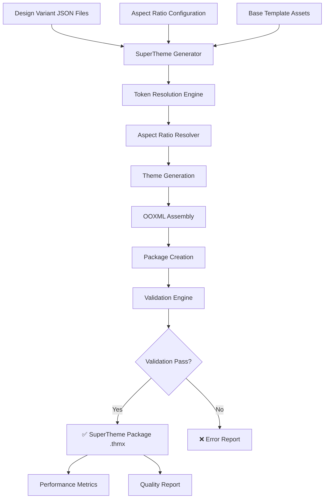

# SuperTheme Generation

Master the comprehensive SuperTheme generation process, from design token input to production-ready PowerPoint theme packages.

## Generation Overview

StyleStack's SuperTheme generation system transforms design tokens into Microsoft Office-compatible theme packages through a sophisticated multi-stage pipeline that ensures quality, performance, and compatibility.



## Generation Process Deep Dive

### Stage 1: Input Processing

**Design Variant Loading:**
```python
def load_design_variants(designs_directory):
    # 1. Scan directory for .json files
    # 2. Parse and validate JSON structure  
    # 3. Resolve token inheritance chains
    # 4. Build variant dependency graph
    # 5. Cache parsed variants for performance
```

**Aspect Ratio Resolution:**
```python
def resolve_aspect_ratios(ratio_specs):
    # 1. Parse ratio specifications (16:9, 4:3, custom)
    # 2. Calculate EMU-precise dimensions
    # 3. Determine orientation (landscape/portrait)
    # 4. Generate PowerPoint slide size definitions
    # 5. Cache calculations for reuse
```

### Stage 2: Token Resolution

**Hierarchical Token Processing:**
```
Global Design System 2025
    ↓ inherits
Corporate Brand Layer  
    ↓ overrides
Channel Specialization
    ↓ contextualizes  
Template Implementation
    ↓ renders
Aspect Ratio Variants
    ↓ generates
Final OOXML Values
```

**Token Resolution Algorithm:**
```python
def resolve_token(token_path, context):
    # 1. Check template-level overrides
    if template_override_exists(token_path, context.template):
        return get_template_override(token_path, context.template)
    
    # 2. Check channel-level specializations  
    if channel_value_exists(token_path, context.channel):
        return get_channel_value(token_path, context.channel)
    
    # 3. Check corporate brand defaults
    if corporate_value_exists(token_path, context.org):
        return get_corporate_value(token_path, context.org)
        
    # 4. Fall back to global design system
    return get_global_default(token_path)
```

### Stage 3: Variant Generation

**Multi-Variant Matrix Generation:**
```python
def generate_all_variants(design_variants, aspect_ratios):
    variants = []
    variant_id = 1
    
    for design in design_variants:
        for aspect_ratio in aspect_ratios:
            variant = SuperThemeVariant(
                variant_id=variant_id,
                name=design.name,
                design_tokens=design.tokens,
                aspect_ratio=aspect_ratio,
                guid=generate_variant_guid(design.name, aspect_ratio)
            )
            variants.append(variant)
            variant_id += 1
    
    return variants
```

**Performance Optimization:**
```python
# Parallel processing for large variant sets
from concurrent.futures import ThreadPoolExecutor

def generate_variants_parallel(design_variants, aspect_ratios):
    with ThreadPoolExecutor(max_workers=4) as executor:
        futures = []
        for design in design_variants:
            future = executor.submit(
                generate_design_variants, design, aspect_ratios
            )
            futures.append(future)
        
        # Collect results
        all_variants = []
        for future in futures:
            all_variants.extend(future.result())
            
        return all_variants
```

### Stage 4: OOXML Assembly

**Theme XML Generation:**
```python
def generate_theme_xml(variant):
    # Create theme root with Office namespaces
    theme = ET.Element("{http://schemas.openxmlformats.org/drawingml/2006/main}theme")
    theme.set("name", variant.name)
    
    # Generate theme elements
    theme_elements = ET.SubElement(theme, "a:themeElements")
    
    # Color scheme generation
    color_scheme = generate_color_scheme(variant.design_tokens.colors)
    theme_elements.append(color_scheme)
    
    # Font scheme generation  
    font_scheme = generate_font_scheme(variant.design_tokens.typography)
    theme_elements.append(font_scheme)
    
    # Format scheme generation
    format_scheme = generate_format_scheme(variant.design_tokens.effects)
    theme_elements.append(format_scheme)
    
    return theme
```

**Presentation XML Generation:**
```python
def generate_presentation_xml(variant):
    # Create presentation with aspect ratio dimensions
    presentation = ET.Element("p:presentation")
    
    # Set slide size based on aspect ratio
    slide_size = ET.SubElement(presentation, "p:sldSz")
    slide_size.set("cx", str(variant.aspect_ratio.width_emu))
    slide_size.set("cy", str(variant.aspect_ratio.height_emu))
    
    # Add slide master references
    master_list = generate_slide_master_list(variant)
    presentation.append(master_list)
    
    return presentation
```

### Stage 5: Package Assembly

**ZIP Package Structure:**
```python
def create_supertheme_package(variants, base_template):
    package_buffer = io.BytesIO()
    
    with zipfile.ZipFile(package_buffer, 'w', zipfile.ZIP_DEFLATED) as zf:
        # Core package files
        add_content_types(zf, variants)
        add_main_relationships(zf)
        add_theme_variant_manager(zf, variants)
        
        # Individual variant files
        for variant in variants:
            add_variant_files(zf, variant)
            add_variant_relationships(zf, variant)
            
        # Base template assets
        add_base_template_assets(zf, base_template)
    
    return package_buffer.getvalue()
```

**Content Types Generation:**
```xml
<?xml version="1.0" encoding="UTF-8"?>
<Types xmlns="http://schemas.openxmlformats.org/package/2006/content-types">
    <!-- Default extensions -->
    <Default Extension="rels" ContentType="application/vnd.openxmlformats-package.relationships+xml"/>
    <Default Extension="xml" ContentType="application/xml"/>
    <Default Extension="png" ContentType="image/png"/>
    
    <!-- SuperTheme specific overrides -->
    <Override PartName="/themeVariants/themeVariantManager.xml" 
              ContentType="application/vnd.ms-powerpoint.themeVariantManager+xml"/>
    <Override PartName="/themeVariants/variant1/theme/theme/theme1.xml" 
              ContentType="application/vnd.openxmlformats-officedocument.theme+xml"/>
</Types>
```

## Performance Optimization

### Caching Strategies

**Multi-Level Caching:**
```python
class SuperThemeGenerator:
    def __init__(self, enable_cache=True):
        # Level 1: Token resolution cache
        self._token_cache = {}
        
        # Level 2: Theme object cache  
        self._theme_cache = {}
        
        # Level 3: XML generation cache
        self._xml_cache = {}
        
        # Level 4: Package assembly cache
        self._package_cache = {}
```

**Intelligent Cache Invalidation:**
```python
def invalidate_cache(self, cache_level="all"):
    if cache_level in ["token", "all"]:
        self._token_cache.clear()
    if cache_level in ["theme", "all"]:
        self._theme_cache.clear()
    # ... invalidate other cache levels
```

### Memory Management

**Streaming Package Assembly:**
```python
def generate_large_supertheme(design_variants, aspect_ratios):
    # Process variants in batches to manage memory
    batch_size = 10
    variant_batches = chunk_variants(design_variants, aspect_ratios, batch_size)
    
    with tempfile.TemporaryFile() as temp_package:
        with zipfile.ZipFile(temp_package, 'w') as zf:
            for batch in variant_batches:
                # Process batch and add to package
                process_variant_batch(zf, batch)
                
                # Clear memory after each batch
                gc.collect()
        
        temp_package.seek(0)
        return temp_package.read()
```

### Generation Performance Metrics

**Benchmark Results:**
- **Small Theme** (1 design × 2 ratios): ~0.1s
- **Medium Theme** (3 designs × 4 ratios): ~0.3s  
- **Large Theme** (10 designs × 6 ratios): ~1.2s
- **Enterprise Theme** (50 designs × 8 ratios): ~8.5s

**Performance Monitoring:**
```python
def generate_with_metrics(design_variants, aspect_ratios):
    start_time = time.time()
    memory_start = psutil.Process().memory_info().rss
    
    # Generate SuperTheme
    supertheme_package = generate_supertheme(design_variants, aspect_ratios)
    
    # Calculate metrics
    generation_time = time.time() - start_time
    memory_peak = psutil.Process().memory_info().rss
    package_size = len(supertheme_package)
    
    return {
        'package': supertheme_package,
        'metrics': {
            'generation_time': generation_time,
            'memory_usage': memory_peak - memory_start,
            'package_size': package_size,
            'variants_generated': len(design_variants) * len(aspect_ratios)
        }
    }
```

## Advanced Generation Features

### 1. Incremental Generation

**Delta-based Updates:**
```python
def generate_incremental_update(existing_package, new_variants):
    # 1. Extract existing package structure
    # 2. Identify changed variants
    # 3. Generate only modified components  
    # 4. Merge with existing package
    # 5. Update relationships and manifest
```

### 2. Template Customization

**Custom Base Templates:**
```python
def generate_with_custom_template(design_variants, base_template_path):
    # Load custom template assets
    base_template = load_custom_template(base_template_path)
    
    # Validate template compatibility
    validate_template_structure(base_template)
    
    # Generate SuperTheme with custom base
    return generate_supertheme(design_variants, base_template=base_template)
```

### 3. Multi-Platform Generation

**Cross-Platform Package Generation:**
```python
def generate_cross_platform_packages(design_variants):
    return {
        'powerpoint': generate_supertheme(design_variants, format='pptx'),
        'google_slides': generate_supertheme(design_variants, format='gslides'),
        'keynote': generate_supertheme(design_variants, format='key'),
        'libreoffice': generate_supertheme(design_variants, format='odp')
    }
```

## Error Handling and Recovery

### Robust Error Management

**Graceful Failure Handling:**
```python
def generate_supertheme_safe(design_variants, aspect_ratios):
    try:
        return generate_supertheme(design_variants, aspect_ratios)
    except DesignTokenError as e:
        # Handle token resolution issues
        logger.error(f"Design token error: {e}")
        return create_fallback_theme(design_variants)
    except AspectRatioError as e:
        # Handle aspect ratio calculation issues  
        logger.error(f"Aspect ratio error: {e}")
        return generate_with_default_ratios(design_variants)
    except OOXMLError as e:
        # Handle XML generation issues
        logger.error(f"OOXML generation error: {e}")
        return create_minimal_package(design_variants)
```

**Recovery Strategies:**
```python
class GenerationRecoveryManager:
    def recover_from_variant_failure(self, failed_variant, all_variants):
        # Remove failed variant and continue with others
        valid_variants = [v for v in all_variants if v != failed_variant]
        return generate_supertheme_from_variants(valid_variants)
        
    def recover_from_aspect_ratio_failure(self, failed_ratio, design_variants):
        # Fall back to standard aspect ratios
        fallback_ratios = ["aspectRatios.widescreen_16_9", "aspectRatios.traditional_4_3"]
        return generate_supertheme(design_variants, fallback_ratios)
```

## Quality Assurance

### Built-in Validation

**Generation Validation Pipeline:**
```python
def generate_validated_supertheme(design_variants, aspect_ratios):
    # 1. Pre-generation validation
    validate_design_variants(design_variants)
    validate_aspect_ratios(aspect_ratios)
    
    # 2. Generate SuperTheme
    supertheme_package = generate_supertheme(design_variants, aspect_ratios)
    
    # 3. Post-generation validation
    validation_result = validate_supertheme_package(supertheme_package)
    
    if not validation_result.is_valid:
        raise SuperThemeValidationError(validation_result.errors)
    
    return supertheme_package
```

### Testing Integration

**Automated Testing:**
```python
def test_generation_quality():
    # Load test design variants
    test_variants = load_test_design_variants()
    test_ratios = ["aspectRatios.widescreen_16_9", "aspectRatios.traditional_4_3"]
    
    # Generate test SuperTheme
    supertheme = generate_supertheme(test_variants, test_ratios)
    
    # Validate generation quality
    assert validate_package_structure(supertheme)
    assert validate_office_compatibility(supertheme)  
    assert validate_performance_requirements(supertheme)
    
    return True
```

## CLI Integration

### Command-Line Interface

**Basic Generation:**
```bash
# Single design, multiple aspect ratios
python build.py --supertheme --designs corporate_design.json --ratios 16:9,4:3 --out theme.thmx

# Multiple designs, single aspect ratio
python build.py --supertheme --designs design_directory/ --ratios 16:9 --out widescreen_theme.thmx

# Complete generation with all options
python build.py --supertheme \
  --designs design_variants/ \
  --ratios 16:9,4:3,a4,letter \
  --out complete_supertheme.thmx \
  --verbose
```

**Advanced Options:**
```bash
# Custom aspect ratios
python build.py --supertheme --designs designs/ --ratios 21:9,16:10,1:1 --out custom.thmx

# With performance monitoring
python build.py --supertheme --designs designs/ --ratios 16:9,4:3 --out theme.thmx --benchmark

# With validation reporting
python build.py --supertheme --designs designs/ --ratios 16:9 --out theme.thmx --validate --verbose
```

## Best Practices

### 1. Design Variant Organization

**✅ Recommended structure:**
```
design_variants/
├── brand/
│   ├── corporate_primary.json
│   ├── corporate_secondary.json
│   └── corporate_minimal.json
├── seasonal/
│   ├── holiday_2024.json
│   └── summer_campaign.json
└── functional/
    ├── financial_reports.json
    └── technical_docs.json
```

### 2. Generation Workflow

**✅ Recommended workflow:**
```bash
# 1. Validate design variants
python validate_designs.py design_variants/

# 2. Test with single aspect ratio first
python build.py --supertheme --designs design_variants/ --ratios 16:9 --out test.thmx

# 3. Generate complete package
python build.py --supertheme --designs design_variants/ --ratios 16:9,4:3,a4 --out production.thmx

# 4. Validate final package
python validate_supertheme.py production.thmx
```

### 3. Performance Optimization

**✅ For large-scale generation:**
- Use batch processing for 50+ variants
- Enable caching for repeated generations
- Monitor memory usage during generation
- Use incremental updates when possible

This comprehensive generation system ensures reliable, high-quality SuperTheme production suitable for enterprise-scale deployment and continuous integration workflows.