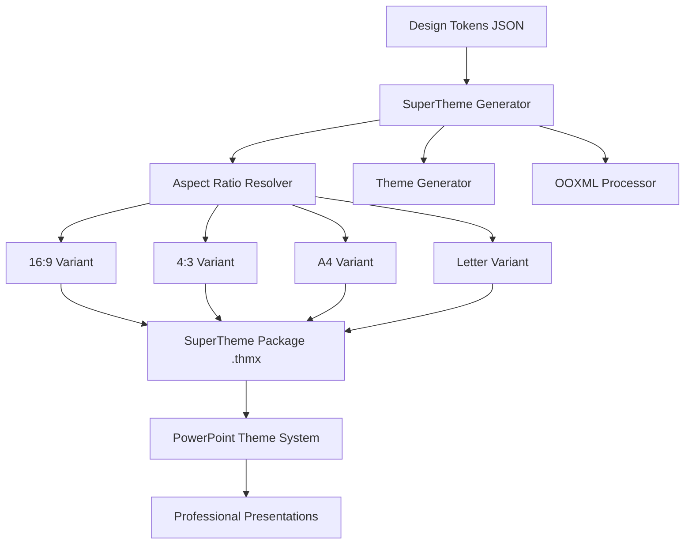

# SuperThemes Overview

StyleStack SuperThemes represent a revolutionary approach to Microsoft PowerPoint design systems, delivering professional, multi-variant presentation themes that automatically adapt to different aspect ratios and design requirements.

## What are SuperThemes?

SuperThemes are advanced Microsoft PowerPoint theme packages (.thmx files) that contain multiple design variants optimized for different aspect ratios, all generated from a single design token system. Unlike traditional PowerPoint themes that require manual customization for different screen sizes, SuperThemes automatically provide the perfect layout for any presentation format.

## Key Features

### 🎨 **Token-Driven Design System**
- **Hierarchical Design Tokens**: Global → Corporate → Channel → Template inheritance
- **Dynamic Variable Resolution**: Automatic token substitution and theme generation
- **JSON-Based Configuration**: Simple, declarative design variant definitions

### 📐 **Multi-Aspect Ratio Support**
- **Widescreen (16:9)**: Modern presentation standard
- **Traditional (4:3)**: Classic presentation format  
- **A4 Landscape**: European document standard
- **Letter Landscape**: US document standard
- **Custom Ratios**: Define your own dimensions

### 🚀 **Professional Office Integration**
- **Office 2016-365 Compatible**: Full compatibility across all modern Office versions
- **Native .thmx Format**: Works seamlessly with PowerPoint's theme system
- **Cross-Platform Support**: Windows, Mac, and Office Online

### ⚡ **Advanced Generation Engine**
- **EMU-Precise Calculations**: Exact dimensions using Office's native measurement units
- **Performance Optimized**: Efficient caching and batch processing
- **Validation System**: Comprehensive quality assurance before deployment

## Business Impact

### For Design Teams
- **Design Once, Deploy Everywhere**: Create one design system that works across all formats
- **Automatic Compliance**: Ensures brand consistency without manual intervention
- **Rapid Iteration**: Update designs globally with token changes

### For IT Departments
- **Zero Maintenance**: Templates update automatically through design token changes
- **Enterprise Scale**: Handle thousands of presentation variants efficiently
- **Quality Assurance**: Built-in validation prevents deployment of broken themes

### For End Users
- **Professional Results**: Every presentation looks professionally designed
- **Format Flexibility**: Switch between aspect ratios without redesign
- **Consistent Branding**: Automatic brand compliance across all presentations

## Architecture Overview

## Getting Started

Ready to create your first SuperTheme? Jump to our [Quick Start Guide](./quick-start) to generate your first multi-variant theme package in under 5 minutes.

## Next Steps

- [**Quick Start**](./quick-start): Create your first SuperTheme
- [**Architecture**](./architecture): Deep dive into the technical foundation  
- [**Design Variants**](./design-variants): Learn how to define design variations
- [**CLI Reference**](./cli-reference): Complete command-line documentation

## Community & Support

- **GitHub**: [StyleStack Repository](https://github.com/stylestack/stylestack)
- **Issues**: Report bugs and request features
- **Discussions**: Join our community for tips and best practices