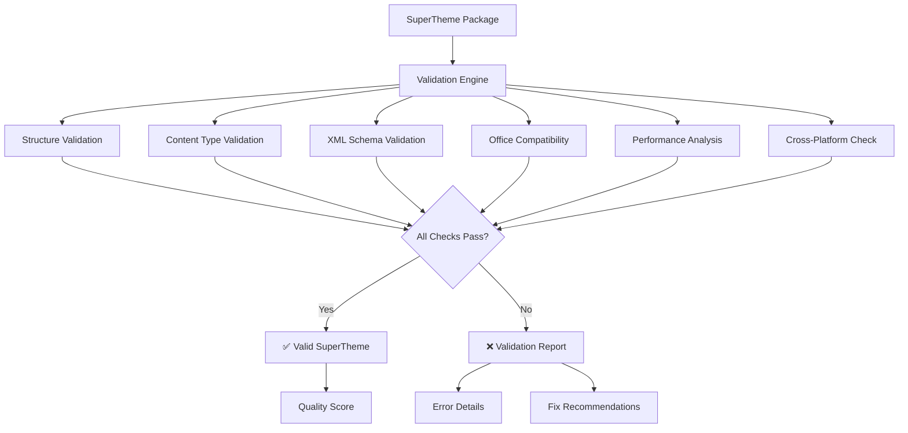

# SuperTheme Validation

Comprehensive validation system ensuring SuperTheme packages meet Microsoft Office compatibility standards, performance requirements, and quality benchmarks.

## Validation Overview

StyleStack's validation engine performs multi-layer quality assurance to guarantee SuperTheme packages work flawlessly across all Office versions and platforms.



## Validation Categories

### 1. Package Structure Validation

Ensures SuperTheme packages contain all required files and follow Microsoft's SuperTheme specification.

**Required Files Check:**
```python
REQUIRED_FILES = [
    "[Content_Types].xml",
    "_rels/.rels", 
    "themeVariants/themeVariantManager.xml",
    "themeVariants/_rels/themeVariantManager.xml.rels"
]

def validate_package_structure(package_data):
    with zipfile.ZipFile(io.BytesIO(package_data)) as zf:
        file_list = zf.namelist()
        
        for required_file in REQUIRED_FILES:
            if not any(required_file in f for f in file_list):
                return ValidationError(f"Missing required file: {required_file}")
```

**Variant Structure Check:**
```python
def validate_variant_structure(zf, variant_dirs):
    for variant_dir in variant_dirs:
        required_variant_files = [
            f"themeVariants/{variant_dir}/theme/theme/theme1.xml",
            f"themeVariants/{variant_dir}/theme/presentation.xml"
        ]
        
        for req_file in required_variant_files:
            if req_file not in zf.namelist():
                return ValidationError(f"Missing {req_file} in {variant_dir}")
```

### 2. Content Type Validation

Verifies MIME type declarations match Microsoft Office requirements.

**Required Content Types:**
```python
REQUIRED_CONTENT_TYPES = [
    "application/vnd.openxmlformats-package.relationships+xml",
    "application/vnd.ms-powerpoint.themeVariantManager+xml", 
    "application/vnd.openxmlformats-officedocument.theme+xml"
]

def validate_content_types(zf):
    content_types_xml = zf.read('[Content_Types].xml').decode('utf-8')
    parser = etree.XMLParser(recover=True, remove_comments=False)
    root = etree.fromstring(content_types_xml.encode('utf-8'), parser)
    
    # Extract all content types
    content_types = []
    for elem in root:
        content_type = elem.get('ContentType')
        if content_type:
            content_types.append(content_type)
    
    # Check required types
    for required_type in REQUIRED_CONTENT_TYPES:
        if required_type not in content_types:
            return ValidationError(f"Missing content type: {required_type}")
```

### 3. XML Schema Validation

Validates XML structure, namespaces, and element compliance.

**Theme Variant Manager Validation:**
```python
def validate_theme_variant_manager(zf):
    manager_xml = zf.read('themeVariants/themeVariantManager.xml').decode('utf-8')
    parser = etree.XMLParser(recover=True, remove_comments=False)
    root = etree.fromstring(manager_xml.encode('utf-8'), parser)
    
    # Check required namespaces
    required_namespaces = {
        "supertheme": "http://schemas.microsoft.com/office/thememl/2012/main",
        "relationships": "http://schemas.openxmlformats.org/officeDocument/2006/relationships",
        "drawingml": "http://schemas.openxmlformats.org/drawingml/2006/main",
        "presentationml": "http://schemas.openxmlformats.org/presentationml/2006/main"
    }
    
    for ns_name, ns_uri in required_namespaces.items():
        if ns_uri not in manager_xml:
            return ValidationError(f"Missing {ns_name} namespace: {ns_uri}")
```

**Theme XML Validation:**
```python
def validate_theme_xml(theme_xml_content):
    parser = etree.XMLParser(recover=True, remove_comments=False)
    theme_root = etree.fromstring(theme_xml_content.encode('utf-8'), parser)
    
    # Check for required theme elements
    required_elements = [
        './/{http://schemas.openxmlformats.org/drawingml/2006/main}themeElements',
        './/{http://schemas.openxmlformats.org/drawingml/2006/main}clrScheme', 
        './/{http://schemas.openxmlformats.org/drawingml/2006/main}fontScheme'
    ]
    
    for element_path in required_elements:
        if theme_root.find(element_path) is None:
            element_name = element_path.split('}')[-1]
            return ValidationWarning(f"Missing {element_name} in theme")
```

### 4. Office Compatibility Validation

Ensures compatibility across Office 2016-365 versions.

**GUID Format Validation:**
```python
def validate_guid_format(guid_string):
    guid_pattern = re.compile(
        r'\{[A-F0-9]{8}-[A-F0-9]{4}-[A-F0-9]{4}-[A-F0-9]{4}-[A-F0-9]{12}\}',
        re.IGNORECASE
    )
    return bool(guid_pattern.match(guid_string))

def validate_variant_guids(zf):
    manager_xml = zf.read('themeVariants/themeVariantManager.xml').decode('utf-8')
    parser = etree.XMLParser(recover=True, remove_comments=False) 
    root = etree.fromstring(manager_xml.encode('utf-8'), parser)
    
    # Find all variant GUIDs
    variants = root.findall('.//*[@vid]')
    for variant in variants:
        guid = variant.get('vid')
        if not validate_guid_format(guid):
            return ValidationError(f"Invalid GUID format: {guid}")
```

**Relationship Validation:**
```python
def validate_relationships(zf):
    rels_files = [f for f in zf.namelist() if f.endswith('.rels')]
    
    for rels_file in rels_files:
        rels_xml = zf.read(rels_file).decode('utf-8')
        parser = etree.XMLParser(recover=True, remove_comments=False)
        root = etree.fromstring(rels_xml.encode('utf-8'), parser)
        
        # Check for relationships
        relationships = root.findall('.//Relationship')
        if len(relationships) == 0:
            # Try with namespace
            ns_relationships = root.findall(
                f'.//{{{REQUIRED_NAMESPACES["relationships"]}}}Relationship'
            )
            if len(ns_relationships) == 0:
                return ValidationWarning(f"No relationships found in {rels_file}")
```

### 5. Performance Validation

Validates file sizes and optimization for PowerPoint performance.

**File Size Validation:**
```python
def validate_performance(package_size_mb, file_count):
    validation_results = []
    
    # Package size limits
    if package_size_mb > 10.0:
        validation_results.append(
            ValidationError(f"Package size {package_size_mb:.2f}MB exceeds 10MB limit")
        )
    elif package_size_mb > 5.0:
        validation_results.append(
            ValidationWarning(f"Package size {package_size_mb:.2f}MB exceeds 5MB recommendation")
        )
    
    # File count limits  
    if file_count > 1000:
        validation_results.append(
            ValidationWarning(f"High file count ({file_count}) may impact performance")
        )
    
    return validation_results
```

**Individual File Size Check:**
```python
def validate_individual_files(zf):
    warnings = []
    
    for file_info in zf.infolist():
        file_size_mb = file_info.file_size / (1024 * 1024)
        if file_size_mb > 1.0:
            warnings.append(
                ValidationWarning(f"Large file: {file_info.filename} ({file_size_mb:.2f}MB)")
            )
    
    return warnings
```

### 6. Cross-Platform Compatibility

Validates compatibility across Windows, Mac, and Office Online.

**Path Validation:**
```python
def validate_cross_platform_paths(zf):
    errors = []
    
    for file_path in zf.namelist():
        # Check for Windows-specific path separators
        if '\\' in file_path:
            errors.append(ValidationError(f"Windows path separator in: {file_path}"))
        
        # Check for absolute paths
        if file_path.startswith('/'):
            errors.append(ValidationError(f"Absolute path: {file_path}"))
        
        # Check for parent directory references
        if '..' in file_path:
            errors.append(ValidationError(f"Parent directory reference: {file_path}"))
        
        # Check filename for invalid characters
        filename = Path(file_path).name
        invalid_chars = '<>:"|?*'
        for char in invalid_chars:
            if char in filename:
                errors.append(
                    ValidationError(f"Invalid character '{char}' in filename: {filename}")
                )
    
    return errors
```

## Validation Results

### ValidationResult Structure

```python
@dataclass
class ValidationResult:
    is_valid: bool
    errors: List[ValidationError] = field(default_factory=list)
    warnings: List[ValidationError] = field(default_factory=list) 
    info: List[ValidationError] = field(default_factory=list)
    package_size_mb: float = 0.0
    variant_count: int = 0
    file_count: int = 0
    
    def add_error(self, category: str, message: str, file_path: str = None):
        self.errors.append(ValidationError(
            category=category,
            message=message, 
            file_path=file_path,
            severity="error"
        ))
        self.is_valid = False
```

### Validation Report Generation

```python
def generate_validation_report(result: ValidationResult) -> str:
    report = ["SuperTheme Validation Report", "=" * 40]
    
    # Summary
    status = "✅ VALID" if result.is_valid else "❌ INVALID"
    report.append(f"Status: {status}")
    report.append(f"Package Size: {result.package_size_mb:.2f} MB")
    report.append(f"Variants: {result.variant_count}")
    report.append(f"Files: {result.file_count}")
    report.append("")
    
    # Errors
    if result.errors:
        report.append(f"❌ Errors ({len(result.errors)}):")
        for error in result.errors:
            file_info = f" in {error.file_path}" if error.file_path else ""
            report.append(f"  • [{error.category}] {error.message}{file_info}")
        report.append("")
    
    # Warnings
    if result.warnings:
        report.append(f"⚠️  Warnings ({len(result.warnings)}):")
        for warning in result.warnings:
            file_info = f" in {warning.file_path}" if warning.file_path else ""
            report.append(f"  • [{warning.category}] {warning.message}{file_info}")
        report.append("")
    
    return "\n".join(report)
```

## Using the Validation System

### CLI Validation

**Command-line validation:**
```bash
# Validate generated SuperTheme
python build.py --supertheme --designs my_designs --ratios 16:9,4:3 --out theme.thmx --validate

# Standalone validation
python -m tools.supertheme_validator theme.thmx

# Verbose validation with detailed reporting
python build.py --supertheme --designs my_designs --ratios 16:9 --out theme.thmx --validate --verbose
```

### Programmatic Validation

**Python API validation:**
```python
from tools.supertheme_validator import SuperThemeValidator

# Create validator
validator = SuperThemeValidator(strict_mode=False)

# Load and validate SuperTheme
with open('theme.thmx', 'rb') as f:
    supertheme_data = f.read()

result = validator.validate_package(supertheme_data)

# Check results
if result.is_valid:
    print("✅ SuperTheme is valid!")
else:
    print("❌ SuperTheme has validation errors:")
    for error in result.errors:
        print(f"  • {error.message}")

# Generate detailed report
report = validator.generate_validation_report(result)
print(report)
```

### Strict Mode Validation

**Enhanced validation for production environments:**
```python
# Enable strict mode for production validation
validator = SuperThemeValidator(strict_mode=True)

# Strict mode additional checks:
# - Stricter file size limits (2MB instead of 5MB)
# - Required accessibility compliance
# - Enhanced cross-platform validation
# - Performance optimization requirements
```

## Common Validation Issues

### 1. Structure Issues

**❌ Missing Required Files:**
```
Error: Missing required file: themeVariants/themeVariantManager.xml
```

**✅ Fix:** Ensure SuperTheme generation includes all required files
```python
# Check generation pipeline includes all required components
def generate_complete_supertheme(design_variants, aspect_ratios):
    # Ensure theme variant manager is generated
    variant_manager_xml = generate_theme_variant_manager(variants)
    # Ensure all relationship files are created
    relationships = generate_all_relationships(variants)
```

### 2. Content Type Issues

**❌ Wrong Content Types:**
```
Error: Missing content type: application/vnd.ms-powerpoint.themeVariantManager+xml
```

**✅ Fix:** Use correct PowerPoint-specific MIME types
```python
# Correct content type for theme variant manager
CONTENT_TYPES = {
    "themeVariantManager": "application/vnd.ms-powerpoint.themeVariantManager+xml",
    "theme": "application/vnd.openxmlformats-officedocument.theme+xml"
}
```

### 3. Namespace Issues

**❌ Missing Namespaces:**
```
Error: Missing drawingml namespace: http://schemas.openxmlformats.org/drawingml/2006/main
```

**✅ Fix:** Include all required Office namespaces
```python
# Complete namespace declarations for theme variant manager
root.set("xmlns:supertheme", "http://schemas.microsoft.com/office/thememl/2012/main")
root.set("xmlns:r", "http://schemas.openxmlformats.org/officeDocument/2006/relationships")
root.set("xmlns:a", "http://schemas.openxmlformats.org/drawingml/2006/main")
root.set("xmlns:p", "http://schemas.openxmlformats.org/presentationml/2006/main")
```

### 4. Performance Issues

**❌ Package Too Large:**
```
Warning: Package size 8.5MB exceeds 5MB recommendation
```

**✅ Fix:** Optimize package size
```python
# Package optimization strategies
def optimize_package_size(supertheme_data):
    # 1. Remove unused theme elements
    # 2. Optimize XML whitespace
    # 3. Compress images efficiently
    # 4. Deduplicate common elements across variants
```

## Validation Best Practices

### 1. Continuous Validation

**✅ Integrate into CI/CD:**
```yaml
# GitHub Actions validation
- name: Validate SuperThemes
  run: |
    python build.py --supertheme --designs designs/ --ratios 16:9,4:3 --out test.thmx --validate
    if [ $? -ne 0 ]; then
      echo "SuperTheme validation failed"
      exit 1
    fi
```

### 2. Pre-deployment Validation

**✅ Production validation checklist:**
```bash
# 1. Structure validation
python -m tools.supertheme_validator theme.thmx --check structure

# 2. Office compatibility  
python -m tools.supertheme_validator theme.thmx --check compatibility

# 3. Performance validation
python -m tools.supertheme_validator theme.thmx --check performance

# 4. Cross-platform validation
python -m tools.supertheme_validator theme.thmx --check cross-platform
```

### 3. Automated Testing

**✅ Unit test validation:**
```python
def test_supertheme_validation():
    # Generate test SuperTheme
    test_variants = load_test_design_variants()
    supertheme_data = generate_supertheme(test_variants, ["aspectRatios.widescreen_16_9"])
    
    # Validate
    validator = SuperThemeValidator()
    result = validator.validate_package(supertheme_data)
    
    # Assert quality
    assert result.is_valid
    assert len(result.errors) == 0
    assert result.package_size_mb < 5.0
    assert result.variant_count > 0
```

This comprehensive validation system ensures your SuperThemes meet professional quality standards and work reliably across all Microsoft Office environments.